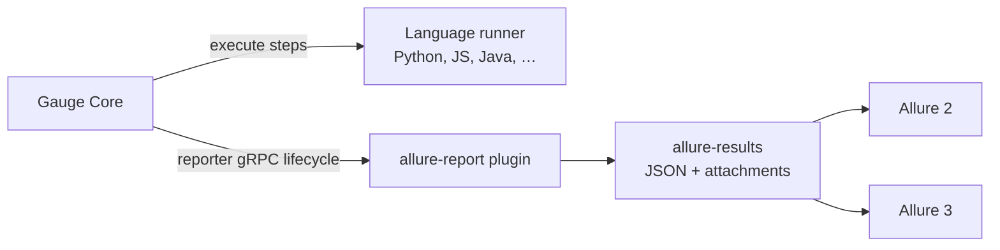

# Gauge Allure Report

Native, runner-independent [Allure Results](https://allurereport.org/docs/how-it-works/) reporter plugin for [Gauge](https://gauge.org/). It consumes Gauge Core’s reporter gRPC protocol and writes Allure result and container JSON directly—there is no JUnit/XML conversion and test implementations do not import an Allure SDK.

> Project status: **pre-1.0 / release candidate**. The protocol, packaging, Windows Gauge 1.6.35 E2E, Gauge Python 0.5.1 on Python 3.14.6, and a Gauge JavaScript smoke test are verified. The public Gauge repository entry and release URLs are prepared but have not been published.

## How it fits



The reporter never imports, starts, patches, or otherwise depends on `gauge-python`. The Python and JavaScript projects in this repository prove that runner independence at the process boundary.

## Install

From the Gauge plugin repository after the project has been accepted:

```console
gauge install allure-report
```

From a release ZIP:

```console
gauge install allure-report --file allure-report-0.1.0-linux.x86_64.zip
```

From source on Windows:

```powershell
./scripts/install-local.ps1 -Version 0.1.0
```

The distributed ZIP contains exactly `plugin.json` and `bin/allure-report` (`.exe` on Windows). Release URLs in `gauge-repository/allure-report-install.json` are templates until the first GitHub release exists.

## Quick start with Gauge Python

`manifest.json`:

```json
{
  "Language": "python",
  "Plugins": ["allure-report"]
}
```

Run the included example:

```console
cd examples/gauge-python
python -m pip install -r requirements.txt
gauge run specs
```

The default destination is `reports/allure-results`. Open it with either generation line:

```console
allure generate reports/allure-results --clean -o reports/allure2
npx -y allure@3.14.3 generate reports/allure-results -o reports/allure3
```

The first command uses the official Allure 2.45.0 CLI archive. The release-conformance scripts download that archive from GitHub and verify SHA-256 `a0a840979b6d212e9eee031563d669985eb353cfde60557343b2903bf08570a6`; the npm wrapper currently lags the upstream release.

The example uses only `getgauge`; it does not install or import `allure-pytest`.

## Output behavior

The destination precedence is `GAUGE_ALLURE_RESULTS_DIR`, then `ALLURE_RESULTS_DIR`, then `${gauge_reports_dir}/allure-results`, then `reports/allure-results`. With `clean_results: true` the reporter removes only known Allure files from an owned directory. It refuses project roots, filesystem roots, home directories, `.git`, symlink traversal, and non-owned nonempty directories unless the explicit weakening option is enabled. With cleaning disabled, each launch writes to a timestamped subdirectory.

Each Gauge scenario/table row/attempt becomes a native Allure test result. Concepts remain nested steps; context, scenario steps, and teardown are named groups by default. Suite, specification, and scenario lifecycle data become fixture containers. Gauge messages, screenshots, tables, CI executor data, environment properties, categories, tags, links, and source links are retained where the protocol provides them.

Status mapping is conservative: assertions and recoverable verifications are `failed`; unexpected exceptions, hook/protocol/parser/validation failures are `broken`; explicit skips are `skipped`; unknown values are never promoted to `passed`. See [the complete mapping](docs/gauge-allure-mapping.md).

## Configuration

Place YAML at `.gauge/allure-report.yaml`, point `GAUGE_ALLURE_CONFIG` at another file, or use environment overrides. Unknown YAML fields are rejected. Start with [examples/allure-report.yaml](examples/allure-report.yaml) and see [configuration.md](docs/configuration.md) and the [JSON Schema](schemas/allure-report.schema.json).

Useful commands:

```console
allure-report validate-config .gauge/allure-report.yaml
allure-report doctor
allure-report --version
```

## Compatibility

| Component | Policy / verified version |
| --- | --- |
| Gauge Core | Windows package install and exhaustive E2E verified on 1.6.22 and 1.6.35 |
| Gauge reporter protocol | `gauge-proto` commit `8a89f7a070a9` |
| Gauge Python | 0.5.1; Python 3.14.6 verified; upstream CI range 3.10–3.14 |
| Gauge JavaScript | 5.0.7 smoke verified |
| Allure | official Allure 2 result model; generation targets 2.45.0 and 3.14.3 |
| OS/arch packages | Linux: x86, x86_64, arm64; Windows: x86, x86_64; macOS: x86_64, arm64 |

The authoritative matrix and evidence levels are in [compatibility.yaml](compatibility.yaml). A tag filter matching no specifications returns from Gauge Core before it starts reporter plugins; the reporter can emit a synthetic skipped result for an empty suite only when Core actually invokes it. See [troubleshooting](docs/troubleshooting.md).

## CI examples

Jenkins with the current Allure 2 plugin syntax:

```groovy
post {
  always {
    allure includeProperties: false, jdk: '', results: [[path: 'reports/allure-results']]
  }
}
```

For Allure 3 in Jenkins, add `allureVersion: '3'`. Full examples are in [docs/jenkins.md](docs/jenkins.md), [docs/github-actions.md](docs/github-actions.md), and `examples/`.

## Security and contributing

Attachments are bounded, regular-file-only, non-symlink inputs by default. Environment metadata is allowlisted and values can be redacted; diagnostic protobuf dumps are opt-in because they can contain test secrets. Report vulnerabilities through a private GitHub Security Advisory as described in [SECURITY.md](SECURITY.md). For development and DCO sign-off, see [CONTRIBUTING.md](CONTRIBUTING.md) and [docs/development.md](docs/development.md).

Licensed under the [Apache License 2.0](LICENSE).
