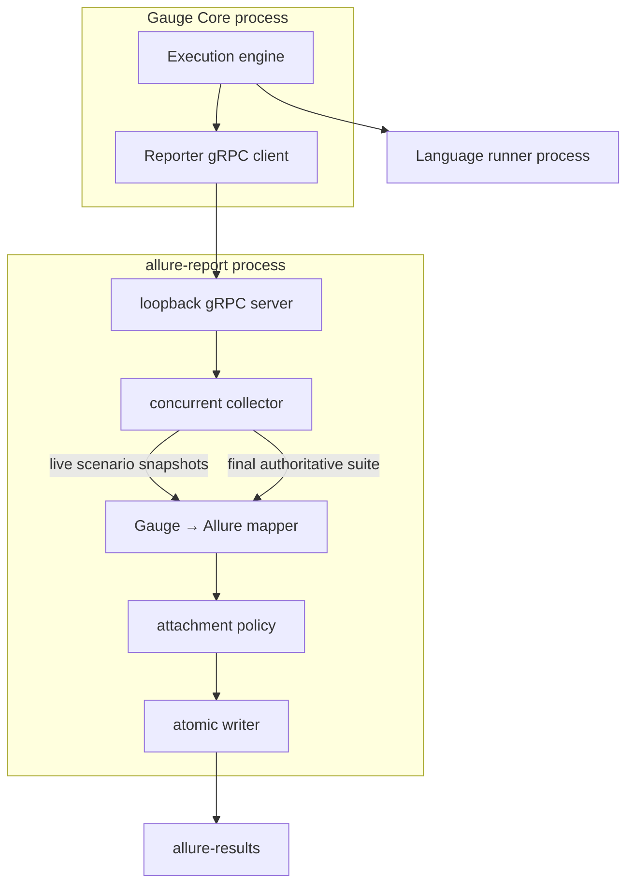

# Architecture

## Goals and boundaries

`allure-report` is a Gauge **reporter** plugin. Gauge Core owns discovery, validation, retries, parallel scheduling, and communication with the language runner. This binary owns reporter lifecycle collection, reconciliation, secure attachment import, Allure mapping, and atomic files. Production code depends only on Gauge’s protobuf/gRPC contract, never a language runner.



## Startup and finalization

```mermaid
sequenceDiagram
  participant G as Gauge Core
  participant P as allure-report
  participant F as Filesystem
  G->>P: start with allure-report_action=execution
  P->>P: load config and prepare guarded output
  P-->>G: stdout: Listening on port:<n>
  G->>P: ExecutionStarting / SpecStart / ScenarioStart
  G->>P: ScenarioEnd (possibly concurrent)
  P->>F: atomic live {uuid}-result.json
  G->>P: SuiteResult(final SuiteExecutionResult)
  P->>P: reconcile live identities/times with final suite
  P->>F: replace final results; write containers and metadata
  G->>P: Kill
  P->>P: graceful stop
```

The single stdout handshake is protocol data. All logs go to stderr so they cannot corrupt plugin discovery.

## Package responsibilities

| Package | Responsibility |
| --- | --- |
| `internal/app` | CLI modes, environment and dependency wiring |
| `internal/server` | all 12 Reporter RPC methods, loopback listener, size limits, shutdown |
| `internal/collector` | mutex-protected live state, retry/stream correlation, final reconciliation |
| `internal/mapping` | nil-safe Gauge tree to official Allure model |
| `internal/identity` | canonical paths, stable SHA-256 identifiers, cryptographic UUIDs |
| `internal/status`, `timing` | conservative status and bounded timestamp decisions |
| `internal/attachments` | containment, symlink/size/type checks, streaming copy, redaction |
| `internal/metadata` | reserved tags, links, labels, executor and environment metadata |
| `internal/output` | guarded cleaning and atomic cross-platform replacement |

There is no global mutable execution state. The mapper is stateless; mutable collector maps are private and mutex-protected. JSON slices are sorted or retain protocol order when that order is semantic.

## Reconciliation model

Live scenario-end callbacks make long/aborted runs observable early. The final suite remains authoritative for final status, parser/validation errors, hook failures, skips, tables, attachments, and fields absent from live events. A composite attempt key uses canonical scenario identity, specification/scenario row indexes, and zero-based retry index. The final one-based attempt count is normalized before lookup. Existing UUIDs are reused, so final atomic writes replace live snapshots instead of duplicating them.

If the process is interrupted after live results, those files remain useful. If it is interrupted before a scenario result, a synthetic broken result is emitted when the shutdown path can run.

## Trust boundaries

The gRPC listener binds only to loopback. Protocol messages and configured paths are untrusted input. File cleaning and attachments use `Lstat`, containment checks, regular-file checks, size limits, bounded metadata, and no symlink following by default. Atomic writes prevent readers from seeing partial JSON. More detail is in [security-and-privacy.md](security-and-privacy.md).
